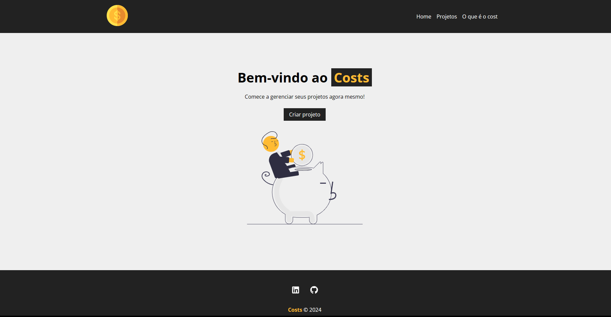

# COSTS


O projeto COSTS é uma plataforma simples e eficaz para o cadastro e gerenciamento de despesas de projetos. Com uma interface amigável, os usuários podem facilmente inserir informações detalhadas sobre os gastos relacionados a cada projeto, categorizá-los e atribuí-los conforme necessário. O sistema oferece uma visão clara do panorama financeiro de cada projeto, permitindo que as equipes acompanhem os gastos de forma organizada e façam ajustes conforme necessário para manterem-se dentro do orçamento estabelecido. 

## Aprendizados

Aprendi sobre componentização, estado, ciclo de vida dos componentes, gerenciamento de estado com hooks, integração com APIs e estilização de componentes ao trabalhar com React pela primeira vez no projeto COSTS. Essas habilidades me forneceram uma base sólida para desenvolver interfaces de usuário dinâmicas e responsivas.


## Screenshots




## Funcionalidades

- Cadastro de Projetos
- Exclusão de Projetos
- Associação a Categorias
- Inserção de Serviços
- Filtragem por Nome de Projeto
- Filtragem por Categoria


## Stack utilizada

**Front-end:** React

**Back-end:**   Simulação por meio do JSON DB Server


## Instalação


Para rodar localmente o projeto COSTS, siga estas etapas:

- 1 Clone o repositório 
```bash
    git clone <https://github.com/alyssonrafael/COSTS>
```
- 2 Instale as dependências:
```bash
    npm install
```
- 3 Inicie o servidor JSON DB:
```bash
     npm run backend
```
- 4 Inicie o Front-End:
```bash
    npm start
```
    
## Licença

[MIT](https://choosealicense.com/licenses/mit/)

